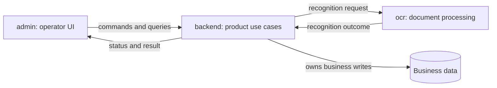

# Example workspace map: admin, backend, and ocr

Illustrative target only. The project names are generic role labels;
responsibilities, interactions, and layers below have not been verified against
any specific repositories. This file is neither an audit report nor a migration decision.
Do not infer installed languages, frameworks, versions, endpoints, or a broker.

The example demonstrates how to fill the root workspace ARCHITECTURE.md.
Replace assumptions with evidence and agreed target decisions during adoption.

## Responsibility map

| Project | Suggested responsibility | Owns | Delegates |
| --- | --- | --- | --- |
| `admin` | Operator-facing document workflows and presentation | UI state, forms, navigation, presentation of backend results | Business decisions and durable state changes to backend |
| `backend` | Product use cases and authoritative document lifecycle | Access decisions, business records, workflow state, acceptance of OCR results | Text/structure extraction to ocr |
| `ocr` | Recognition and technical processing of a submitted document | Recognition pipeline and its technical result/error contract | Product access rules and final business state to backend |

Stack/version evidence: not inspected for this example. Fill each project's
passport from manifests, lockfiles, and its actual runtime before implementation.
The names do not imply that admin uses Next.js, backend uses PHP, or ocr uses Python.

## Logical runtime interactions

These arrows show logical communication, not imports or a chosen delivery
mechanism. In particular, OCR-to-backend does not imply an HTTP callback.

| Interaction | Example logical contract | Responsibility and constraints |
| --- | --- | --- |
| admin → backend | Submit a document / request recognition | Backend validates the request and authorizes the operation; the UI does not grant itself access |
| backend → ocr | `RecognizeDocument`: job ID, document ID, file reference, supported options | OCR validates its own input contract; file access is explicitly scoped |
| ocr → backend | `RecognitionOutcome`: correlation IDs, extracted data or a defined failure | Backend validates the result and decides its effect on business state |
| admin → backend → admin | Query document status and accepted result | Backend remains the source of truth; presentation follows its public response contract |

Contract names are descriptive examples, not existing API names. Record actual
schemas and owners in the real map. Typed DTOs are serialized at process/language
boundaries; they are not shared in-memory domain or ORM instances.

## Example scenario: document recognition

The following assumes asynchronous processing for illustration. It does not
require adding a queue, worker service, callback endpoint, or polling mechanism.
Choose the actual mechanism according to observed constraints and agreed needs.

1. Admin submits the document through the backend contract and displays the
   returned identifier and processing status.
2. Backend validates input, checks access, records the document/job state, and
   issues a recognition request through an OCR adapter.
3. OCR resolves the permitted file reference, performs needed preprocessing and
   recognition, and produces the contracted result or technical error.
4. Backend receives or retrieves that outcome, matches it to the correct job,
   applies business rules, and updates its authoritative state.
5. Admin reads the backend's current state and presents the accepted result,
   processing state, or actionable failure.

If delivery can repeat, the backend must not apply the same outcome twice.
Define timeout/retry ownership and stale-result handling in the actual contract.
A database transaction does not automatically span backend and OCR; document
the point at which a submitted job is durably accepted. Required product behavior
on failed recognition is an explicit decision, not something inferred from this example.

## Internal responsibilities and code dependencies

Suggested responsibilities below are adapted to each project; folders and class
names are chosen in its passport. Do not scaffold empty layers to match this table.

| Project / area | Responsibility | Permitted dependency direction |
| --- | --- | --- |
| admin / routes and UI | Compose screens and receive user actions | Uses product feature contracts |
| admin / features | Forms, local interaction state, display transformations | Uses typed API adapters and shared UI utilities |
| admin / API boundary | Serialize requests and validate received data | Uses the published backend contract, not backend internals |
| backend / presentation | Thin HTTP/CLI/queue entry points and DTO validation | Calls application use cases |
| backend / application | Coordinate document operations and workflow | Uses domain behavior and required ports/interfaces |
| backend / domain | Invariants, value objects, and meaningful state transitions | Independent of UI, transport clients, and processing engines |
| backend / infrastructure | Persistence, file access, and OCR integration | Implements required ports; dependencies wired at composition root |
| ocr / entry boundary | Receive and validate a recognition job | Calls the processing use case |
| ocr / processing | Coordinate preprocessing, recognition, and result normalization | Uses explicit engine/file-access contracts |
| ocr / adapters | Integrate storage and recognition libraries/services | Implements those contracts; does not decide product workflow state |

Runtime calls and import dependencies differ: a backend use case may call an
injected OCR adapter through a port without importing the concrete HTTP client.
If an ORM is present, its relationship with domain classes is a separate explicit
project decision; this example does not select a Doctrine mapping profile.

## Ownership boundaries

- Admin does not write backend tables or contact OCR directly in this proposed flow.
- OCR returns extraction results; it does not update backend business tables.
- Backend decides whether recognition output is accepted, requires human correction,
  or changes product state. OCR can enforce its own technical processing invariants.
- File persistence, retention, and permitted readers must have a named owner.
  An OCR file reference is not permission for unrestricted filesystem/storage access.
- Shared transport schemas do not justify importing another project's internal
  domain classes. Contract changes must account for the affected consumer.

## What must be established for a real project map

Verify repository paths, actual responsibilities, language/framework versions,
existing contracts, authentication, transport, state ownership, and failure behavior.
Record differences between this example and the actual or agreed target design.
Do not rewrite a project just to make its implementation match the diagram.

Use [the workspace template](../templates/workspace-architecture.md) for the
root map and [project passports](../templates/project-architecture.md) for details.
